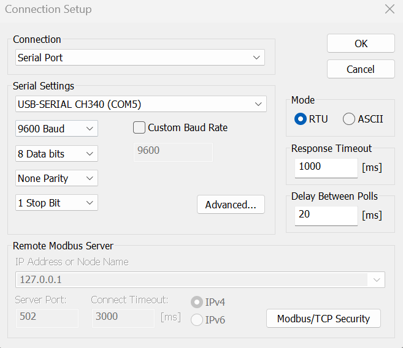
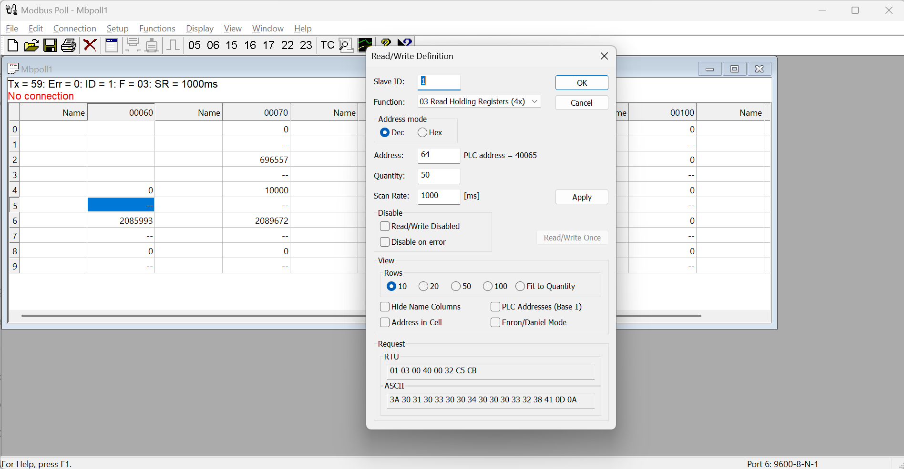

# Dokumentasi Skript Python sebagai Logger dari Fort FCN300

## Setup

```
git clone https://github.com/primaelectric-automation/Electric_Meter_Logger.git

-- Python 3.9

python -m venv .myenv
.\myenv\Scripts\activate
python -m pip install -r requirements.txt
python read_meter.py
```

## Settingan Modbus Poll





## Masalah dengan Driver

Jika anda mengalami masalah dengan Driver dengan Warning seperti berikut (windows 11):

```
PermissionError(13, 'A device attached to the system is not functioning.', None, 31)
```

Anda perlu menginstall ulang driver CH340 dari :

```
https://github.com/kelasrobot/USB-DRIVER-CH340-versi-3.5
```

pastikan anda melakukan uninstall terlebih dahulu lalu melakukan install setelahnya.